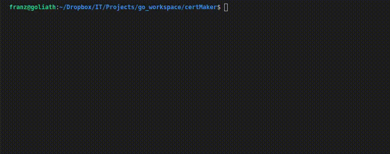
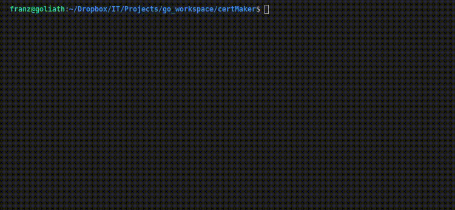

<h1 align="center">
  CertMaker
</h1>

  
    

Project created with the goal of making self-signed certificate creation and management easy. Empowers users with a single executable to create and store CA certificates, private keys and sign new device certificates.

It is written entirely in Golang and uses sqlite to store pem encoded Certificates and PK's

## Under Construction....

## Installation

## Usage

CertMaker can be used in silent mode by passing all attributes via command line or responding to prompts by not passing any arguments at all.
The resulting certificates and keys are generated in the same location where CertMaker is being run

### Create CA

#### **Flags and Arguments**

  * `-ca-address`: Certificate Authority Street Address (default "101 Market St")
  * `-ca-country`: Certificate Authority Country (2 letter) (default "US")
  * `-ca-identifier`: Internal Identifier for the CA (Required to create a CA or sign a Cert)
  * `-ca-locality`: Certificate Authoritiy Locality (default "San Francisco")
  * `-ca-organization`: Certificate Authority Name (default "Example, Inc")
  * `-ca-province`: Certificate Authority Province (2 letter) (default "CA")
  * `-ca-zipcode`: Certificate Authority Zip Code (default "94016")

#### **Prompt Mode**

### Create and Sign Certificate

#### **Flags and Arguments**

  * `-ca-identifier`: ID or name of CA that will be used to signed the Certificate
  * `-server-identifier`: ID or name for the Certificate being created
  * `-server-address`: Address for the Certificate
  * `-server-common-name`: FQDN or Hostname the Certificate will be identifying
  * `-server-country`: Country for the Certificate (2 letters)
  * `-server-locality`: Locality for the Certificate
  * `-server-organization`: Organization for the Certificate
  * `-server-province`: Province for the Certificate
  * `-server-zipcode`: Zip Code for the Certificate
  * `-subject-alterative-hostname`: Alternate hostnames that the Certificate can be idetified as
  * `-subject-alternate-ip`: Alternate IP that the Certificate can be identified as

#### **Prompt Mode**

### Features
* The "silent" mode uses the "flag" package
* The "wizard" mode uses the <a href="https://github.com/manifoldco/promptui">promptui</a> package
* Certificates can be verified using OpenSSL

## Features in the works
* Encrypt SQLite DB to enhance security for storing Certificates and Keys
* Potentially add a web version of the application
* Add querying for past Certificates or CA's
* Add tests
